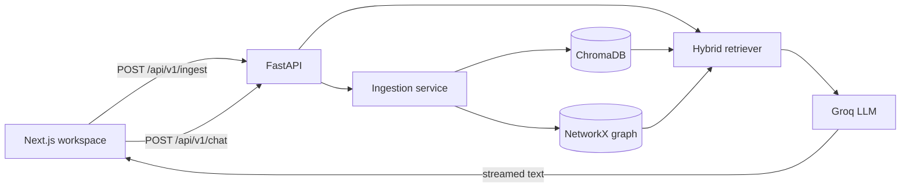

# Grag

Grag is a local-first, full-stack GraphRAG workspace. It extracts structured
relationships from source documents, stores semantic chunks in embedded
ChromaDB, persists a NetworkX knowledge graph, and streams grounded answers to
a Next.js chat interface.

## Architecture



The app requires no graph or vector database server. ChromaDB and NetworkX
both persist directly inside the project directory.

## Features

- Versioned FastAPI routes and automatic OpenAPI documentation
- JSON, pasted-text, `.txt`, and `.md` ingestion
- Pydantic-validated structured relationship extraction
- Embedded ChromaDB vector search and persisted NetworkX traversal
- Token-by-token streamed chat responses
- Adjustable semantic `top_k` and one/two-hop graph retrieval
- Responsive Next.js App Router interface with Tailwind CSS and Lucide icons
- Local-first setup with no Docker requirement

## Project structure

```text
grag/
├── frontend/
│   ├── app/
│   │   ├── globals.css          # Tailwind theme and shared styles
│   │   ├── layout.tsx           # Root layout and metadata
│   │   └── page.tsx             # Chat workspace page
│   ├── components/
│   │   ├── chat-shell.tsx       # Streaming chat state and composition
│   │   ├── ingestion-dialog.tsx # Text/file ingestion workflow
│   │   ├── message-list.tsx     # Conversation rendering
│   │   └── settings-sidebar.tsx # Retrieval controls
│   ├── lib/api.ts               # Typed FastAPI client
│   ├── types/index.ts           # Shared frontend types
│   └── package.json
├── models/
│   └── schemas.py               # Pydantic API and LLM schemas
├── routers/
│   ├── chat.py                  # Streaming chat route
│   └── ingest.py                # JSON and multipart ingestion route
├── services/
│   ├── graph_store.py           # NetworkX persistence
│   ├── ingestion.py             # Chunking, extraction, and dual writes
│   └── retriever.py             # Hybrid retrieval and generation
├── main.py                      # FastAPI app, CORS, and route mounting
└── requirement.txt              # Python dependencies
```

Runtime data is written to `data/graph.json` and `chroma_db/`; both are ignored
by Git.

## Requirements

- Python 3.11 or newer
- [uv](https://docs.astral.sh/uv/)
- Node.js 20.9 or newer
- A [Groq API key](https://console.groq.com/keys)

## Backend setup

From the repository root, create the Python environment and install packages:

```powershell
uv venv
.venv\Scripts\Activate.ps1
uv pip install -r requirement.txt
```

Copy the environment template and add your Groq key:

```powershell
Copy-Item .env.example .env
```

```dotenv
GROQ_API_KEY=replace_with_your_groq_api_key
GROQ_BASE_URL=https://api.groq.com/openai/v1
GRAG_LLM_MODEL=openai/gpt-oss-20b
```

Start FastAPI in the first terminal:

```powershell
python -m uvicorn main:app --reload --env-file .env --port 8000
```

The backend is available at:

- API: <http://localhost:8000>
- Swagger UI: <http://localhost:8000/docs>
- OpenAPI schema: <http://localhost:8000/openapi.json>

## Frontend setup

Open a second terminal while the backend remains running:

```powershell
cd frontend
Copy-Item .env.local.example .env.local
npm install
npm run dev
```

Open <http://localhost:3000>. The checked-in default already targets
`http://localhost:8000`; set `NEXT_PUBLIC_API_URL` in `.env.local` only when the
backend uses a different address.

You now have both development servers running simultaneously:

| Service | Command | Address |
| --- | --- | --- |
| FastAPI | `python -m uvicorn main:app --reload --env-file .env --port 8000` | `http://localhost:8000` |
| Next.js | `npm run dev` from `frontend/` | `http://localhost:3000` |

## API endpoints

| Method | Path | Content type | Description |
| --- | --- | --- | --- |
| `GET` | `/` | — | Health check |
| `POST` | `/api/v1/ingest` | JSON or multipart form | Persist text chunks and graph triples |
| `POST` | `/api/v1/chat` | JSON | Retrieve context and stream an answer |

### Ingest JSON

```powershell
$body = @{
    text = "Grag uses ChromaDB for vector search and NetworkX for graph traversal."
    metadata = @{ source = "quickstart" }
} | ConvertTo-Json

Invoke-RestMethod `
    -Method Post `
    -Uri http://localhost:8000/api/v1/ingest `
    -ContentType "application/json" `
    -Body $body
```

### Ingest a file

```powershell
curl.exe -X POST "http://localhost:8000/api/v1/ingest" `
    -F "file=@notes.md"
```

Uploads must be UTF-8 `.txt` or `.md` files no larger than 10 MB. A multipart
request may also use a `text` field and an optional JSON-encoded `metadata`
field.

### Stream chat

```powershell
'{"query":"What does Grag use?","top_k":5,"graph_hops":2}' |
    curl.exe -N -X POST "http://localhost:8000/api/v1/chat" `
    -H "Content-Type: application/json" `
    --data-binary "@-"
```

The plain-text response is streamed as it is generated. Diagnostic counts are
returned in `X-Grag-Vector-Chunks` and `X-Grag-Graph-Triples` headers.

## Verification

Validate the frontend before shipping changes:

```powershell
cd frontend
npm run typecheck
npm run build
npm audit --omit=dev
```

For backend route discovery and interactive requests, use Swagger UI at
<http://localhost:8000/docs>.

## Current scope

Grag is designed for local development and single-instance deployments.
Authentication, tenant isolation, rate limiting, and distributed transactions
are not included yet.
