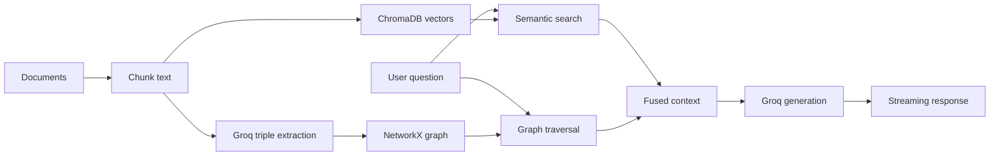

# Grag

Grag is a local-first hybrid GraphRAG backend built with FastAPI. It combines
semantic retrieval from ChromaDB with explicit relationship traversal from a
NetworkX knowledge graph, then uses a Groq-hosted LLM to generate a grounded,
streaming answer.

## How it works



During ingestion, Grag stores each text chunk in ChromaDB and extracts directed
entity relationships into NetworkX. During retrieval, it searches for
semantically related chunks, traverses one or two graph hops from matching
entities, and combines both sources into the prompt sent to Groq.

## Features

- Async FastAPI backend with automatic OpenAPI documentation
- Local embedded ChromaDB vector storage
- Persistent NetworkX `MultiDiGraph` knowledge graph
- Pydantic-validated structured entity and relationship extraction
- Concurrent document chunk extraction with bounded LLM concurrency
- Stable document and chunk identifiers for idempotent vector upserts
- Hybrid semantic and graph retrieval
- Streaming `POST /chat` responses
- No external graph or vector database server required

## Technology

| Component | Purpose |
| --- | --- |
| FastAPI | HTTP API and streaming responses |
| Pydantic v2 | Request and structured-output validation |
| ChromaDB | Embedded vector database |
| `all-MiniLM-L6-v2` | Chroma's default local embedding model |
| NetworkX | Local knowledge graph and traversal |
| Groq | Hosted LLM inference |
| `openai/gpt-oss-20b` | Triple extraction and answer generation |
| uv | Python environment and dependency management |

## Requirements

- Python 3.11 or newer
- [uv](https://docs.astral.sh/uv/)
- A [Groq API key](https://console.groq.com/keys)

## Setup

Clone the repository and enter its root directory:

```powershell
git clone https://github.com/alenAlex707/grag.git
cd grag
```

Create and activate a virtual environment on Windows PowerShell:

```powershell
uv venv
.venv\Scripts\Activate.ps1
```

Install the dependencies:

```powershell
uv pip install -r requirement.txt
```

Create a `.env` file in the project root:

```dotenv
GROQ_API_KEY=replace_with_your_groq_api_key
GROQ_BASE_URL=https://api.groq.com/openai/v1
GRAG_LLM_MODEL=openai/gpt-oss-20b
```

The `.env` file and local database files are ignored by Git.

## Run the API

```powershell
python -m uvicorn main:app --reload --env-file .env
```

The service is available at:

- API: <http://127.0.0.1:8000>
- Swagger UI: <http://127.0.0.1:8000/docs>
- OpenAPI schema: <http://127.0.0.1:8000/openapi.json>

Test the health endpoint:

```powershell
Invoke-RestMethod http://127.0.0.1:8000/
```

Expected response:

```json
{
  "status": "healthy",
  "service": "Grag"
}
```

## Ingest a document

An HTTP ingestion route has not been added yet. Run the ingestion service
directly from the project root:

```powershell
@'
import asyncio

from dotenv import load_dotenv

from services.ingestion import IngestionService


load_dotenv(".env")

text = """
Grag is a hybrid retrieval-augmented generation system.
Grag uses ChromaDB for semantic vector search.
Grag uses NetworkX for knowledge graph traversal.
Groq generates answers from the fused retrieval context.
"""

summary = asyncio.run(IngestionService().ingest(text))
print(summary)
'@ | python -
```

The first ingestion may take longer while Chroma downloads its local embedding
model. When ingestion runs in a separate process, restart Uvicorn afterward so
the API reloads the persisted NetworkX graph.

## Ask a question

Start the API, then send a request from PowerShell. Piping the JSON through
standard input avoids PowerShell's `curl` alias and quoting behavior:

```powershell
'{"query":"What does Grag use?","top_k":5,"graph_hops":2}' |
    curl.exe -N -X POST "http://127.0.0.1:8000/chat" `
    -H "Content-Type: application/json" `
    --data-binary "@-"
```

Example response:

```text
Grag uses ChromaDB for semantic vector search and NetworkX for knowledge graph traversal.
```

### Chat payload

| Field | Type | Default | Description |
| --- | --- | --- | --- |
| `query` | string | required | Question to answer |
| `top_k` | integer | `5` | Number of semantic chunks to retrieve, from 1 to 20 |
| `graph_hops` | integer | `2` | Graph traversal depth, either 1 or 2 |

The response is streamed as `text/plain`. It also includes these diagnostic
headers:

- `X-Grag-Vector-Chunks`
- `X-Grag-Graph-Triples`

## API endpoints

| Method | Path | Description |
| --- | --- | --- |
| `GET` | `/` | Service health check |
| `POST` | `/chat` | Hybrid retrieval and streamed answer generation |

## Project structure

```text
grag/
├── data/                   # Persisted NetworkX graph data
├── chroma_db/              # Embedded ChromaDB data
├── models/
│   └── schemas.py          # Pydantic request and extraction schemas
├── routers/
│   └── chat.py             # Streaming chat endpoint
├── services/
│   ├── graph_store.py      # NetworkX persistence and mutation helpers
│   ├── ingestion.py        # Chunking, extraction, and dual-write pipeline
│   └── retriever.py        # Hybrid retrieval and Groq streaming
├── main.py                 # FastAPI application
└── requirement.txt         # Runtime dependencies
```

## Local persistence

- NetworkX graph: `data/graph.json`
- ChromaDB: `chroma_db/`

Both locations are excluded from Git. NetworkX is loaded when the application
starts, while ChromaDB uses its embedded persistent client directly.

## Current limitations

- Ingestion is currently invoked through Python rather than an HTTP endpoint.
- NetworkX is an in-process graph store and is intended for local or
  single-instance use.
- Extraction accuracy depends on the source text and LLM output.
- Graph and vector writes are not a distributed transaction.
- Authentication, rate limiting, and production deployment configuration have
  not yet been added.
